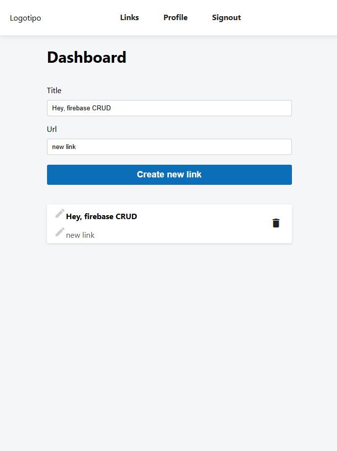

<a id="readme-top"></a>

<h1 align="center">React + Firebase (Auth, database, storage) Ready-To-Go Template</h1>

<div align="center">
    
    
</div>

<div align="center">
<strong> Basic template for a React app with Firebase integration. </strong>
</div>

>

## Prerequisites

1. Node.js -> [Download](https://nodejs.org/en/download/)
2. Firebase account -> [Sign up](https://firebase.google.com/)

## Installation

1. Clone the repository

```bash
git clone https://github.com/alexjamesmx/React-Firebase-Auth-CRUD && cd React-Firebase-Auth-CRUD
```

2. Install dependencies

```bash
npm install
```

3. Create a Firebase project and get the configuration object
4. Create a `.env` file in the root directory and add the following:

````bash
# Your Firebase credentials
  REACT_APP_API_KEY=
  REACT_APP_AUTHDOMAIN=
  REACT_APP_PROJECTID=
  REACT_APP_STORAGEBUCKET=
  REACT_APP_MESSAGINGSENDERID=
  REACT_APP_APPID=
  REACT_APP_MEASUREMENTIDN=

5. Activate the Firebase services you want to use (Auth, Firestore, Storage)

6. Run the app
```bash
npm start
````

## Getting Started
